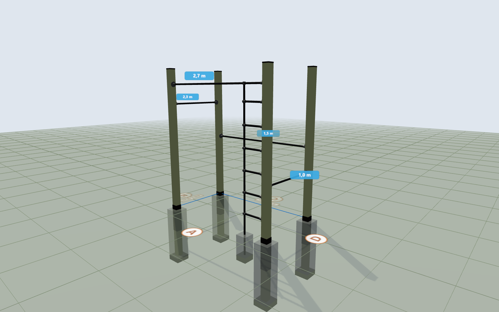

# Calisthenics Rig Designer

An interactive planner for a backyard calisthenics / pull-up rig. Draw the
ground plan top‑down, place posts, bars, ladders and a person, and get live
structural feedback (safe load, breaking load, deflection, foundation
stiffness) plus a 3D view, a material list and a pipe/wood cutting plan.

**▶ Run it in your browser (no install): <https://krauhe.github.io/calisthenics-rig-designer/>**



> The UI is in Danish 🇩🇰 (with an English toggle).

## Tabs

**Project**
- **Kort (Map)** — top‑down CAD‑style editor: a left‑hand tool palette (select/move,
  post, connect, ladder, person, delete), grid snapping, alignment guides, pan/zoom
  (remembered across reloads), and editable tables for posts, connections and persons.
  Per‑post **height, burial depth and hole size**; posts flagged **red** when too soft;
  connections flagged red when under‑dimensioned. A global **pipe‑wall** assumption.
- **3D** — the same design rendered in Three.js (posts, bars, Kee‑fittings, ladders,
  foundations, a person), drag to rotate, scroll to zoom.
- **Materialer (Materials)** — shopping list (posts, bars, fittings, concrete, gravel,
  tar, screws) and a visual **cutting plan** that bin‑packs steel/wood into stock lengths,
  all derived from the actual per‑post dimensions on the map.

**Analysis** (calculators, independent of the drawing)
- **Stolpe (Post)** — foundation/sway analysis for a single post vs. burial depth.
- **Bar** — bending: safe working load, breaking load and deflection vs. span.

Other: **da/en** i18n, **per‑tab units** (m/ft, mm/in), named **save/load** to a JSON
file, and **autosave** to `localStorage`.

## Run it

- **From the web (recommended):** open <https://krauhe.github.io/calisthenics-rig-designer/>.
  It's served by GitHub Pages straight from this repo's `main` branch — every push
  redeploys automatically (~1 min). Three.js loads from a CDN, so you need to be online
  the first time.
- **Offline, single file:** double‑click [`chalestetics-lokal.html`](chalestetics-lokal.html)
  — everything (HTML/CSS/JS) bundled into one self‑contained file.
- **Locally, multi‑file:** open [`index.html`](index.html) (loads the `src/` scripts).

## Develop

Source lives in `src/` (framework‑free classic scripts: `core/` engine + `ui/` views).
After any change, regenerate both entry points:

```sh
python build.py   # rebuilds index.html (multi-file) and chalestetics-lokal.html (bundle)
```

There is no compile/bundler step to *run* the app — `build.py` just concatenates the
sources. Math is checked by `tests/` (open `tests/run-tests.html` in a browser).

## Engineering assumptions

Simplified hand‑calculation models for planning, **not** a substitute for a structural
engineer:

- Steel water pipe: E = 210 GPa, yield ≈ 195 MPa, ultimate ≈ 320 MPa (EN 10255 S195T);
  wall thickness is a single adjustable assumption (default 3.2 mm, EN 10255 medium).
- Wood (C24 pine): E ≈ 10 GPa, bending strength ≈ 24 MPa.
- Kee‑clamp end fixity estimated at 25 % (between pinned and fixed); a bound ladder
  relieves its bar as an extra support.
- Soil horizontal subgrade modulus ≈ 20 MN/m³; foundation rotational stiffness scales
  with hole width and depth.
- Loads are static; add a dynamic factor (≈ ×2) for swinging/jumping.

## Disclaimer

This tool produces **simplified estimates for planning only**. It is **not** a substitute
for a qualified structural engineer, and **no guarantee is made as to the correctness,
accuracy, or fitness for any purpose** of any result it produces. You use it **entirely at
your own risk**. The author accepts **no liability** for any injury, damage, or loss
arising from its use. Always have load‑bearing or body‑weight‑bearing structures reviewed
and verified by a qualified professional before building. (This is in addition to the
warranty disclaimer in the [GPLv3](LICENSE).)

## Tech

Vanilla JS (framework‑free classic scripts) + Three.js (loaded from a CDN). No build step
required to run.

## License

[GNU GPLv3](LICENSE) — © 2026 Kristian Rauhe Harreby. You may copy, modify and
redistribute, including commercially, but derivative works must remain open source under
the GPLv3 and credit the author.

🤖 Built with [Claude Code](https://claude.com/claude-code).
